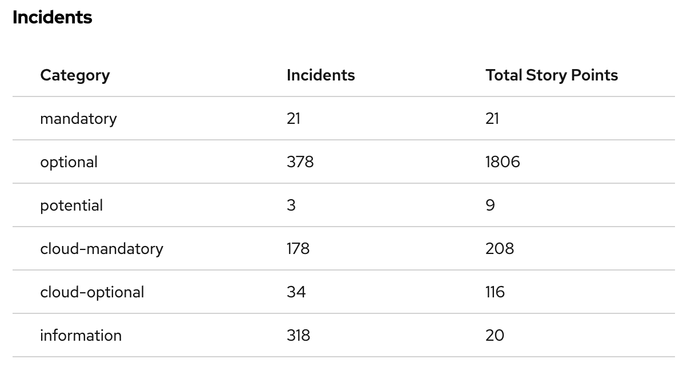
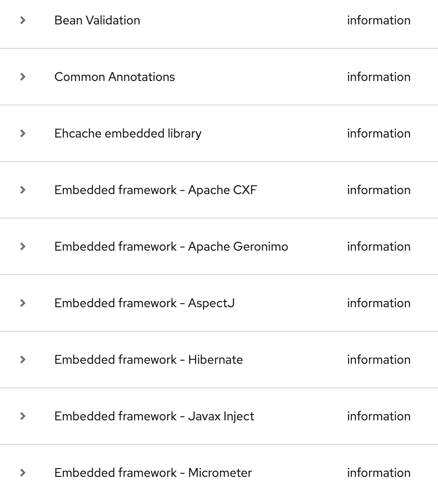

# Azure Application and Code Assessment Toolkit

This guide describes how to assess and replatform any type of Java applications with Azure AppCAT (Application and Code Assessment Toolkit) to evaluate their readiness to migrate to Azure.

[//]: # (TODO VIDEO)

## What is Azure AppCAT?

[Azure AppCAT](https://github.com/azure/appcat-rulesets) is a generic application and code assessment tool to replatform them to Azure. It helps customers to modernize and replatform large-scale Java applications through a broad range of transformations, use cases, and code patterns.

It discovers application technology usage through static code analysis, supports effort estimation, and accelerates code replatforming, helping you move applications to Azure.

Azure AppCAT is based on [WindUp](https://github.com/windup). Created by Red Hat, WindUp is an open-source project (published under the Eclipse Public License EPL) that bundles a set of tools, engines, and rules to assess and replatform Java applications to different targets (Azure services, Java 17, Jakarta EE 10, Quarkus, Spring, etc.).
Azure AppCAT includes Azure targets (Azure App Service, Azure Kubernetes Service, Azure Container Apps and Azure Spring Apps) as well as specific Azure replatforming rules.

## When should I use Azure AppCAT?

Azure AppCAT is designed to help organizations modernize their Java applications in a way that reduces costs and enables faster innovation.
The tool uses advanced analysis techniques to understand the structure and dependencies of any Java application, and provides guidance on how to refactor and migrate the applications to Azure.
With Azure AppCAT you can:

* **Discover technology usage**: quickly see which technologies an application uses. This is very useful if you have legacy applications with not much documentation and want to know which technologies they use. 
* **Assess the code to a specific target**: Assess an application for a specific Azure target. Check the effort and the modifications you will have to do in order to replatform your applications to Azure.  

### How to discover technology usage without an Azure target in mind?

Discovery of technologies is the first stage of application replatform and modernization.
During the _discovery_ phase, Azure AppCAT scans the application and its components to gain a comprehensive understanding of its structure, architecture, and dependencies.
This information is used to create a detailed inventory of the application and its components (see the [Discovery report](#discovery-report) section), which serves as the basis for further analysis and planning.

```shell
$ ./appcat-cli --input ./<my_application> \
  --target discovery
```

The `discovery` phase is useful for when users don't have a specific Azure target in mind. Otherwise, AppCAT will run `discovery` implicitly for any Azure target below.

### How to assess a Java application for a specific Azure target?

The assessment phase is where Azure AppCAT analyzes the application and its components to determine its suitability for replatorming and to identify any potential challenges or limitations.
This phase involves analyzing the application code and check its compliance with the selected Azure target.
The assessment also provides an evaluation of the application's readiness for the cloud, including any necessary refactoring or restructuring that may be required.

Azure AppCAT is very flexible, and you can create any transformation target you want (by aggregating a set of rules).

```shell
$ ./appcat-cli --listTargetTechnologies

Available target technologies:
	azure-aks
	azure-appservice
	azure-container-apps
	azure-spring-apps
	discovery
```

Then it's just a matter of executing Azure AppCAT using one of the available Azure tagets.

```shell
$ ./appcat-cli --input ./<my_application> \
  --target azure-appservice
```

## What results can I get from Azure AppCAT?

The outcome of the discovery and assessment phases is a detailed report that provides a roadmap for the replatforming and modernization of the Java application, including recommendations for the Azure service and replatform approach.
The report serves as the foundation for the next stages of the replatforming process, and helps organizations to learn about the effort required for such transformation, and take decisions about how to modernize their applications for maximum benefits.

The report generated by Azure AppCAT provides a comprehensive overview of the application and its components.
You can use this report to gain insights into the structure and dependencies of the application, and to determine its suitability for replatform and modernization.

### Summary of the analysis

The landing page of the report lists all the technologies that are used in the application.
The dashboard provides a summary of the analysis, including the number of transformation incidents, the incidents categories, or the story points.


When you zoom in on the _Incidents by Category_ pie chart, you can see the number of incidents by category: _Mandatory_, _Optional_, _Potential_, _Information_.
The dashboard also shows the _story points_. 
The story points are an abstract metric commonly used in Agile software development to estimate the level of effort needed to implement a feature or change.
Azure AppCAT uses story points to express the level of effort needed to migrate a particular application.
It does not necessarily translate to man-hours, but the value should be consistent across tasks.



### Discovery report

The discovery report is a report that is generated during the _Discovery Phase_.
It shows the list of technologies used by the application in the _Information_ category.
This means that Azure AppCAT is just informing you about the technology that it discovered.



### Assessment report

The assessment report gives an overview of the transformation issues that would need to be solved to migrate the application to Azure. 
These "_Issues_", also called "_Incidents_", have a severity (_Mandatory_, _Optional_, _Potential_, _Information_), a level of effort and the number of story points (number of incidents x the effort).


### Detail information for a specific issue

For each incident, you can get more information (the issue detail, the content of the rule, etc.), but also the list of all the files that are affected by this incident.


Then, for each file/class that is affected by the incident, you can jump into the source code to highlight the line of code that created the issue.


## How should I use Azure AppCAT?

Azure AppCAT is a CLI (Command-line Interface) tool that can be executed in any operating system (Windows, Linux, Mac OS).

### Requirements

Azure AppCAT for Java requires JDK 11 installed.

### Command Line

The CLI may be executed in standalone mode with one specific application as input, or in batch mode for multiple applications. It can also be used in any CI/CD pipeline.
The CLI generates reports at a specified output directory.

## Custom rules

Azure AppCAT can be seen as a rule engine.
It uses rules to extract files from Java archives, decompiles Java classes, scans and classifies file types, analyzes these files, and builds the reports.
In Azure AppCAT, the rules are defined in the form of a ruleset, which is a collection of individual rules that define specific issues or patterns that should be detected during the analysis.
These rules are defined in XML and follow this simple rule pattern:

```
when(condition)
    perform(action)
    otherwise(action)
```

Azure AppCAT provides a comprehensive set of standard migration rules out-of-the-box.
But because applications may contain custom libraries or components, Azure AppCAT allows you to write your own rules to identify use of components or software that may not be covered by the existing ruleset.
For that, it use a rich DSL (_Domain Specific Language_) expressed in XML.

For example, let's say we want a rule that identifies the use of the PostgreSQL JDBC driver in a Java application and suggests the use of the Azure PostgreSQL Flexible Server instead.
We need a rule to find the PostgreSQL JDBC driver defined in a Maven `pom.xml` or a Gradle file.

```xml
<dependency>
    <groupId>org.postgresql</groupId>
    <artifactId>postgresql</artifactId>
    <scope>runtime</scope>
</dependency>
```

To detect the use of this dependency, the rule uses several XML tags:

* `ruleset`: The unique identifier of the ruleset. A ruleset is a collection of rules that are related to a specific technology or topic.
* `targetTechnology`: The technology that the rule targets. In this case, we are targeting Azure App Services, AKS, Azure Spring Apps and Azure Container Apps.
* `rule`: The root element of a single rule.
* `when`: The condition that must be met for the rule to be triggered.
* `perform`: The action to be performed when the rule is triggered.
* `hint`: The message to be displayed in the report, its category (Information, Optional, Mandatory) and effort to be fixed (range from 1 easy to 13 difficult).

```xml
<ruleset id="azure-postgre-flexible-server"
         xmlns="http://windup.jboss.org/schema/jboss-ruleset"
         xmlns:xsi="http://www.w3.org/2001/XMLSchema-instance"
         xsi:schemaLocation="http://windup.jboss.org/schema/jboss-ruleset http://windup.jboss.org/schema/jboss-ruleset/windup-jboss-ruleset.xsd">
    <metadata>
        <description>Recommend Azure PostgreSQL Flexible Server.</description>
        <dependencies>
            <addon id="org.jboss.windup.rules,windup-rules-xml,3.0.0.Final"/>
        </dependencies>
        <targetTechnology id="azure-appservice"/>
        <targetTechnology id="azure-aks"/>
        <targetTechnology id="azure-container-apps"/>
        <targetTechnology id="azure-spring-apps"/>
    </metadata>
    <rules>
        <rule id="azure-postgre-flexible-server">
            <when>
                <project>
                    <artifact groupId="org.postgresql" artifactId="postgresql"/>
                </project>
            </when>
            <perform>
                <hint title="Azure PostgreSQL Flexible Server" category-id="mandatory" effort="7">
                    <message>The application uses PostgreSQL. It is recommended to use Azure PostgreSQL Flexible Server instead.</message>
                    <link title="Azure PostgreSQL Flexible Server documentation" href="https://learn.microsoft.com/azure/postgresql/flexible-server/overview"/>
                </hint>
            </perform>
        </rule>
    </rules>
</ruleset>
```

Once this rule is uploaded to Azure AppCAT, it's just a matter of running an analysis again and check the report.
Like any other incident, the issues and the files that are affected by this rule will be listed in the assessment report.


## Frequently asked questions

Q: Where do I download Azure AppCAT from?

A: You can download Azure AppCAT from https://windup.github.io/downloads

Q: Where can I find more information about Azure AppCAT?

A: Azure AppCAT has several online guides. From an overview of the tool to the installation and execution of the tool, to the creation of custom rules. You can find all the guides in the [Azure AppCAT documentation](https://access.redhat.com/documentation/en-us/migration_toolkit_for_applications/6.0)

Q: Where can I find the specific Azure rules?

A: All the Azure rules are available in the [Azure AppCAT Ruleset GitHub repository](https://github.com/windup/windup-rulesets/tree/master/rules/rules-reviewed/azure)

Q: Where can I find more information about creating custom rules?

A: WindUp has a dedicated guide to [create custom rules](https://access.redhat.com/documentation/en-us/migration_toolkit_for_applications/6.0/html-single/rules_development_guide/index)
