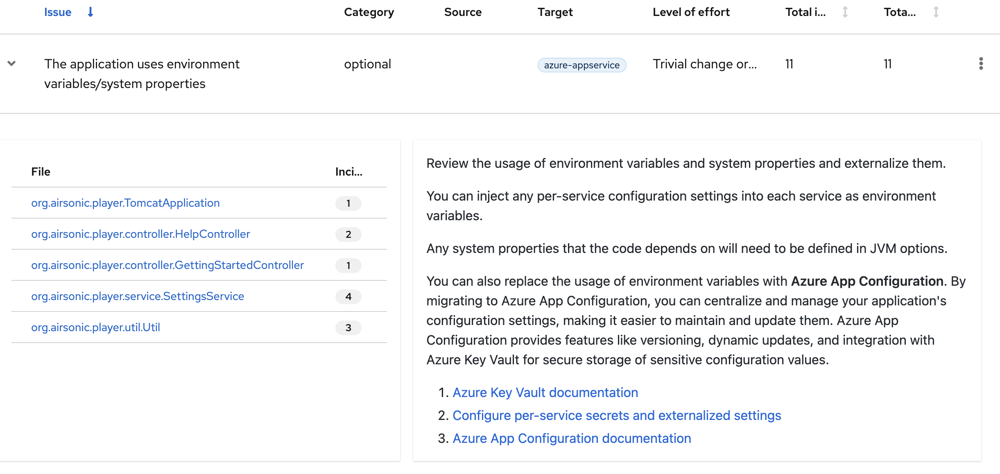

# Azure Application and Code Assessment Toolkit

This guide describes how to assess and replatform any type of Java applications with Azure _AppCAT_ (Application and Code Assessment Toolkit) to evaluate their readiness to migrate to Azure.

[//]: # (TODO VIDEO)

## What is Azure AppCAT?

[Azure AppCAT](https://github.com/azure/appcat-rulesets) is a generic application and code assessment tool to replatform them to Azure.
It helps customers to modernize and replatform large-scale Java applications through a broad range of transformations, use cases, and code patterns.

It discovers application technology usage through static code analysis, supports effort estimation, and accelerates code replatforming, helping you move Java applications to Azure.

Azure AppCAT is based on [WindUp](https://github.com/windup).
WindUp is an open-source project created by Red Hat and published under the [Eclipse Public License](https://www.eclipse.org/org/documents/epl-v10.html) EPL).
It bundles a set of tools, engines, and rules to assess and replatform Java applications to different targets (Azure services, Java 17, Jakarta EE 10, Quarkus, Spring, etc.).
Azure AppCAT includes Azure targets (Azure App Service, Azure Kubernetes Service, Azure Container Apps and Azure Spring Apps) and specific Azure replatforming rules.

## When should I use Azure AppCAT?

Azure AppCAT is designed to help organizations modernize their Java applications in a way that reduces costs and enables faster innovation.
The tool uses advanced analysis techniques to understand the structure and dependencies of any Java application, and provides guidance on how to refactor and migrate the applications to Azure.
With Azure AppCAT you can:

* **Discover technology usage**: quickly see which technologies an application uses.
Discovery is useful if you have legacy applications with not much documentation and want to know which technologies they use.
* **Assess the code to a specific target**: Assess an application for a specific Azure target.
Check the effort and the modifications you have to do in order to replatform your applications to Azure.

## How to install Azure AppCAT?

Azure AppCAT can be run on Windows, Linux or Mac.
It requires Java 11 or Java 17 to be installed.

Download Azure AppCAT and unzip it in a folder of your choice.
You then get the following directory structure:

```shell
├── docs
│   └── appcat-cli-guide.html
├── README.md
└── microsoft-appcat-cli-<version>   # APPCAT_HOME
    ├── bin
    │   ├── appcat-cli
    │   └── appcat-cli.bat
    └── samples
        ├── airsonic.war
        ├── run-assessment
        ├── run-assessment-custom-rules
        └── run-discovery
```

* `docs`: This directory contains the documentation of Azure AppCAT.
* `microsoft-appcat-cli-<version>/bin`: This directory contains the Azure AppCAT CLI executables (for Windows/Linux/Mac).
* `microsoft-appcat-cli-<version>/samples`: This directory contains a sample application and several scripts to run Azure AppCAT against the sample application.

To run the tool, open a terminal session and type:

```bash
$ $APPCAT_HOME/bin/appcat-cli --help
```

To run the tool from anywhere in your computer, configure the directory `APPCAT_HOME/bin` into your `PATH` environment variable and then restart your terminal session.

### How to discover technology usage without an Azure target in mind?

Discovery of technologies is the first stage of application replatform and modernization.
During the _discovery_ phase, Azure AppCAT scans the application and its components to gain a comprehensive understanding of its structure, architecture, and dependencies.
This information is used to create a detailed inventory of the application and its components (see the [Discovery report](#discovery-report) section), which serves as the basis for further analysis and planning.

```shell
$ ./appcat-cli --input ./<my_application> \
  --target discovery
```

The `discovery` phase is useful for when users don't have a specific Azure target in mind.
Otherwise, AppCAT runs `discovery` implicitly for any Azure target.

### How to assess a Java application for a specific Azure target?

The assessment phase is where Azure AppCAT analyzes the application and its components to determine its suitability for replatorming and to identify any potential challenges or limitations.
This phase involves analyzing the application code and checks its compliance with the selected Azure target.
To check the available Azure targets, run the following command:

```shell
$ ./appcat-cli --listTargetTechnologies

Available target technologies:
	azure-aks
	azure-appservice
	azure-container-apps
	azure-spring-apps
```

Then it's just a matter of executing Azure AppCAT using one of the available Azure targets.

```shell
$ ./appcat-cli --input ./<my_application> \
  --target azure-appservice
```

## What results can I get from Azure AppCAT?

The outcome of the discovery and assessment phases is a detailed report that provides a roadmap for the replatforming and modernization of the Java application, including recommendations for the Azure service and replatform approach.
The report serves as the foundation for the next stages of the replatforming process.
It and helps organizations to learn about the effort required for such transformation, and take decisions about how to modernize their applications for maximum benefits.

The report generated by Azure AppCAT provides a comprehensive overview of the application and its components.
You can use this report to gain insights into the structure and dependencies of the application, and to determine its suitability for replatform and modernization.

### Summary of the analysis

The landing page of the report lists all the technologies that are used in the application.
The dashboard provides a summary of the analysis, including the number of transformation incidents, the incidents categories, or the story points.


When you zoom in on the _Incidents by Category_ pie chart, you can see the number of incidents by category: _Mandatory_, _Optional_, _Potential_, _Information_.
The dashboard also shows the _story points_.

The story points are an abstract metric commonly used in Agile software development to estimate the level of effort needed to implement a feature or change.
Azure AppCAT uses story points to express the level of effort needed to migrate a particular application.
It doesn't necessarily translate to work hours, but the value should be consistent across tasks.


### Discovery report

The discovery report is a report that is generated during the _Discovery Phase_.
It shows the list of technologies used by the application in the _Information_ category.
This report is just informing you about the technology that Azure AppCAT has discovered.


### Assessment report

The assessment report gives an overview of the transformation issues that would need to be solved to migrate the application to Azure.

These _Issues_, also called _Incidents_, have a severity (_Mandatory_, _Optional_, _Potential_, _Information_), a level of effort and the number of story points (number of incidents x the effort).


### Detail information for a specific issue

For each incident, you can get more information (the issue detail, the content of the rule, etc.) just by clicking on it. 
You also get the list of all the files that are affected by this incident.



Then, for each file/class that is affected by the incident, you can jump into the source code to highlight the line of code that created the issue.


## How should I use Azure AppCAT?

Azure AppCAT is a CLI (Command-line Interface) tool that can be executed in any operating system (Windows, Linux, Mac).

[//]: # (TODO: Uncomment once we have the WebConsole and IDE Plugins published)
[//]: # (Depending on your needs, there are several ways of using Azure CAT:)
[//]: # (* Web Console)
[//]: # (* IDE Plugin &#40;Eclipse, Eclipse CHE and VS Code)
[//]: # (* Command Line Interface)

### Requirements

Azure AppCAT for Java requires JDK 11 or JDK 17 installed.

### Command Line

The CLI may be executed in standalone mode with one specific application as input, or in batch mode for multiple applications.
It can also be used in any CI/CD pipeline.
The CLI generates reports at a specified output directory.

[//]: # (TODO: Uncomment once we have the WebConsole and IDE Plugins published)
[//]: # (### Web console)
[//]: # (The Azure CAT Web console allows a team of users to assess and analyze applications.)
[//]: # (These users can be _administrators_, who configure the credentials, repositories, and proxies, and _developers_ who perform the application assessment.)
[//]: # (Then, the developers can share the reports with any stakeholders.)
[//]: # (![Web Console]&#40;./media/windup/execute-webconsole.png&#41;)
[//]: # (### VS Code extension)
[//]: # (You can also assess applications by using the Azure CAT VS Code extension.)
[//]: # (It allows developers to run an analysis from their IDE, having access to all the Azure CAT reports and having the ability to directly point the migration issues right into their code.)
[//]: # (![VS Code]&#40;./media/windup/execute-vscode.png&#41;)

## Custom rules

Azure AppCAT can be seen as a rule engine.
It uses rules to extract files from Java archives, decompiles Java classes, scans and classifies file types, analyzes these files, and builds the reports.
In Azure AppCAT, the rules are defined in the form of a ruleset.
A ruleset is a collection of individual rules that define specific issues or patterns that can be detected during the analysis.
These rules are defined in XML and follow this following rule pattern:

```
when(condition)
    perform(action)
    otherwise(action)
```

Azure AppCAT provides a comprehensive set of standard migration rules.
But because applications may contain custom libraries or components, Azure AppCAT allows you to write your own rules to identify use of components or software that may not be covered by the existing ruleset.
To write a custom rule, you use a rich DSL (_Domain Specific Language_) expressed in XML.

For example, let's say we want a rule that identifies the use of the PostgreSQL JDBC driver in a Java application and suggests the use of the Azure PostgreSQL Flexible Server instead.
We need a rule to find the PostgreSQL JDBC driver defined in a Maven `pom.xml` or a Gradle file.

```xml
<dependency>
    <groupId>org.postgresql</groupId>
    <artifactId>postgresql</artifactId>
    <scope>runtime</scope>
</dependency>
```

To detect the use of this dependency, the rule uses several XML tags:

* `ruleset`: The unique identifier of the ruleset.
A ruleset is a collection of rules that are related to a specific technology.
* `targetTechnology`: The technology that the rule targets.
In this case, we're targeting Azure App Services, AKS, Azure Spring Apps and Azure Container Apps.
* `rule`: The root element of a single rule.
* `when`: The condition that must be met for the rule to be triggered.
* `perform`: The action to be performed when the rule is triggered.
* `hint`: The message to be displayed in the report, its category (Information, Optional, Mandatory) and effort to be fixed (range from 1 easy to 13 difficult).

```xml
<ruleset id="azure-postgre-flexible-server"
         xmlns="http://windup.jboss.org/schema/jboss-ruleset"
         xmlns:xsi="http://www.w3.org/2001/XMLSchema-instance"
         xsi:schemaLocation="http://windup.jboss.org/schema/jboss-ruleset http://windup.jboss.org/schema/jboss-ruleset/windup-jboss-ruleset.xsd">
    <metadata>
        <description>Recommend Azure PostgreSQL Flexible Server.</description>
        <dependencies>
            <addon id="org.jboss.windup.rules,windup-rules-xml,3.0.0.Final"/>
        </dependencies>
        <targetTechnology id="azure-appservice"/>
        <targetTechnology id="azure-aks"/>
        <targetTechnology id="azure-container-apps"/>
        <targetTechnology id="azure-spring-apps"/>
    </metadata>
    <rules>
        <rule id="azure-postgre-flexible-server">
            <when>
                <project>
                    <artifact groupId="org.postgresql" artifactId="postgresql"/>
                </project>
            </when>
            <perform>
                <hint title="Azure PostgreSQL Flexible Server" category-id="mandatory" effort="7">
                    <message>The application uses PostgreSQL. It is recommended to use Azure PostgreSQL Flexible Server instead.</message>
                    <link title="Azure PostgreSQL Flexible Server documentation" href="https://learn.microsoft.com/azure/postgresql/flexible-server/overview"/>
                </hint>
            </perform>
        </rule>
    </rules>
</ruleset>
```

After executing this rule through Azure AppCAT, rerun the analysis to review the generated report.
Similar to other incidents, the assessment report lists the identified issues and affected files related to this rule.


## Frequently asked questions

Q: Where do I download Azure AppCAT from?

A: You can download Azure AppCAT from https://windup.github.io/downloads

Q: Where can I find more information about Azure AppCAT?

A: When you download Azure AppCAT, you get a `docs` directory with all the information you need to get started.

Q: Where can I find the specific Azure rules?

A: All the Azure rules are available in the [Azure AppCAT Ruleset GitHub repository](https://github.com/azure/windup-rulesets)

Q: Where can I find more information about creating custom rules?

A: WindUp has a dedicated guide to [create custom rules](https://access.redhat.com/documentation/en-us/migration_toolkit_for_applications/6.0/html-single/rules_development_guide/index)

Q: Where can I find some help when creating custom rules?

A: The best is to [create an issue on the AppCAT GitHub repository](https://github.com/Azure/windup-rulesets/issues)
