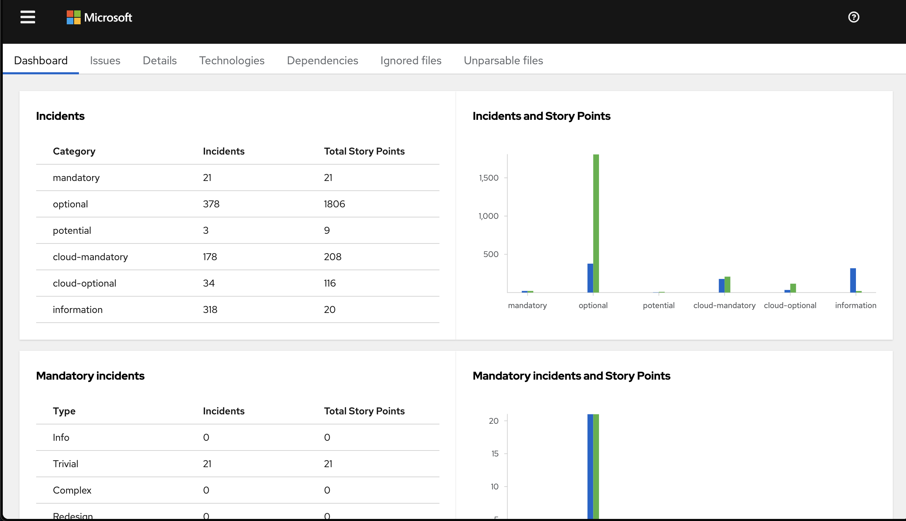
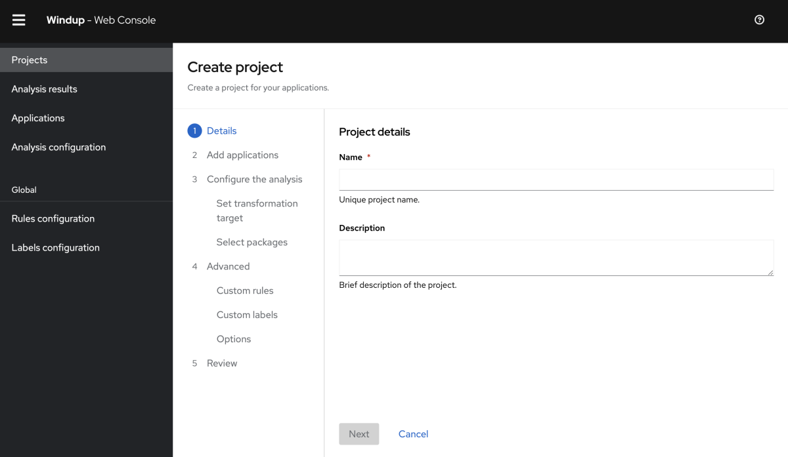
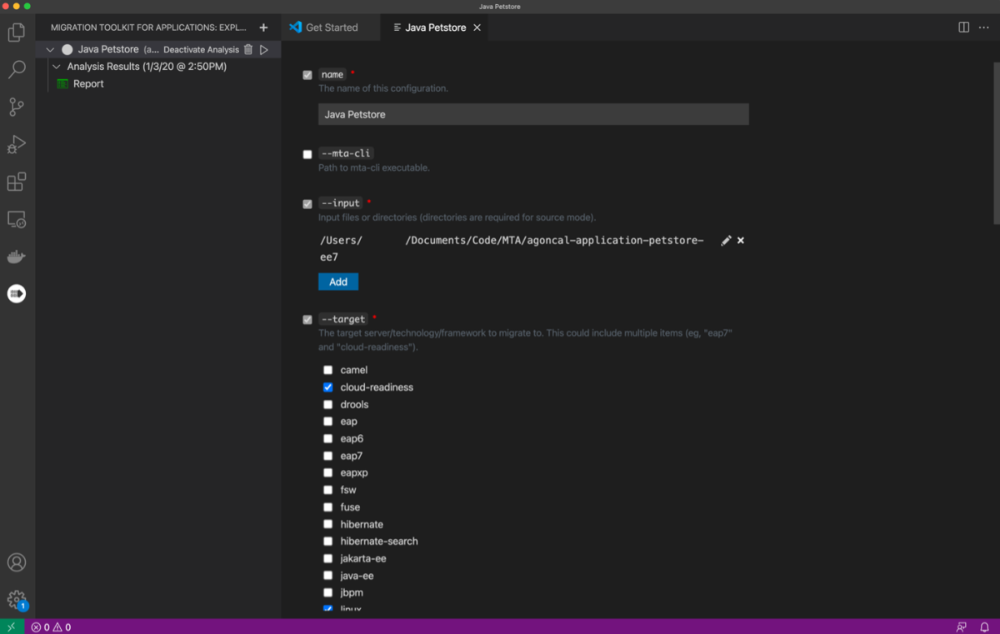

# Discover and Assess Java Applications with WindUp

This guide describes how to discover and assess any type of Java applications with WindUop to evaluate their readiness to migrate to Azure.

[//]: # (TODO VIDEO)

## When should I use WindUp?

[WindUp](https://github.com/windup) is a generic application migration and assessment tool.
It helps large-scale Java application modernization and migration projects across a broad range of transformations and use cases.
It discovers applications through static code analysis, supports effort estimation, accelerates code migration, helping you move applications to Azure.

Created in 2013 by RedHat, WindUp is an open-source project (Eclipse Public License) that bundles a set of rules to transform Java applications to different targets: Azure, JBoss EAP, Camel, Spring, SpringBoot, Quarkus or OpenShift.

Windup is designed to help organizations modernize their applications in a way that reduces costs and enables faster innovation.
The tool uses advanced analysis techniques to understand the structure and dependencies of any Java application, and provides guidance on how to refactor and migrate the applications to Azure.

WindUp is part of a broader set of migration tools that live under the umbrella project called [Konveyor](https://www.konveyor.io/).

### Discovering Java applications

Discovery and assessment are the first stages of application migration and modernization when using a tool like Windup.
During the _discovery_ phase, the WindUp scans the application and its components to gain a comprehensive understanding of its structure, architecture, and dependencies.
This information is used to create a detailed inventory of the application and its components, which serves as the basis for further analysis and planning.


### Assessing Java application for a specific Azure target

After the discovery phase you have the optional _assessment_ phase.
The assessment phase is where WindUp analyzes the application and its components to determine its suitability for migration and to identify any potential challenges or limitations.
This phase involves analyzing the application code and check its compliance with the migration target.
The assessment also provides an evaluation of the application's readiness for migration, including any necessary refactoring or restructuring that may be required.

WindUp is very flexible, and you can create any transformation target you want (by aggregating a set of rules).
It comes with existing targets (JBoss EAP, Camel, Spring, SpringBoot, Quarkus), and includes a set of Azure targets.

* Azure App Services
* Azure Container Apps
* Azure Kubernetes Service (AKS) 


## What results can I get from WindUp?

The outcome of the discovery and assessment phases is a detailed report that provides a roadmap for the migration and modernization of the Java application, including recommendations for the Azure platform and migration approach.
The report serves as the foundation for the next stages of the migration process, and helps organizations take decisions about how to modernize their applications for maximum benefits.

The report generated by Windup provides a comprehensive overview of the application and its components.
You can use this report to gain insights into the structure and dependencies of the application, and to determine its suitability for migration and modernization.

### Summary of the analysis

The landing page of the report lists all the technologies that are used in the application.
The dashboard provides a summary of the analysis, including the number of transformation incidents, the incidents categories, or the story points.



When you zoom in on the _Incidents by Category_ pie chart, you can see the number of incidents by category: _Mandatory_, _Optional_, _Potential_, _Information_.
The dashboard also shows the _story points_. 
The story points are an abstract metric commonly used in Agile software development to estimate the level of effort needed to implement a feature or change.
WindUp uses story points to express the level of effort needed to migrate a particular application.
It does not necessarily translate to man-hours, but the value should be consistent across tasks.


### Discovery report

The discovery report is a report that is generated during the _Discovery Phase_.
It shows the list of technologies used by the application in the _Information_ category.
This means that WindUp is just informing you about the technology that it discovered.


### Assessment report

The assessment report gives an overview of the transformation issues that would need to be solved to migrate the application to Azure. 
These "_Issues_", also called "_Incidents_", have a severity (_Mandatory_, _Optional_, _Potential_, _Information_), a level of effort and the number of story points (number of incidents x the effort).


### Detail information for a specific issue

For each incident, you can get more information (the issue detail, the content of the rule, etc.), but also the list of all the files that are affected by this incident.


Then, for each file/class that is affected by the incident, you can jump into the source code to highlight the line of code that created the issue.


## How should I use WindUp?

Depending on your needs, there are several ways of using WindUp:

* [Web Console](https://access.redhat.com/documentation/en-us/migration_toolkit_for_applications/6.0/html-single/user_interface_guide/index)
* IDE Plugin (Eclipse, Eclipse CHE and [VS Code](https://access.redhat.com/documentation/en-us/migration_toolkit_for_applications/6.0/html-single/visual_studio_code_extension_guide/index))
* [Command Line Interface](https://access.redhat.com/documentation/en-us/migration_toolkit_for_applications/6.0/html-single/cli_guide/index)

### Web console

The WindUp Web console allows a team of users to assess and analayze applications.
These users can be _administrators_, who configure the credentials, repositories, and proxies, and _developers_ who perform the application assessment.
Then, the developers can share the reports with any stakeholders.



### VS Code extension

You can also assess applications by using the WindUp VS Code extension.
It allows developers to run an analysis from their IDE, having access to all the WindUp reports as well as having the ability to directly point the migration issues right into their code.



### Command Line

The WindUp CLI allows users to discover and assess application using the command-line.
It also allows WindUp analysis to be executed in a CI/CD pipeline.
The CLI provides the same reports as the Web console or the VS Code extension.
It just highlights the analysis without the overhead of the other tools. 

## How can I create a new rule?

WindUp can be seen as a rule engine.
It uses rules to extract files from Java archives, decompiles Java classes, scans and classifies file types, analyzes these files, and builds the reports.
In Windup, the rules are defined in the form of a ruleset, which is a collection of individual rules that define specific issues or patterns that should be detected during the analysis.
These rules a defined in XML and follow this simple rule pattern:

```
when(condition)
    perform(action)
    otherwise(action)
```

WindUp provides a comprehensive set of standard migration rules out-of-the-box.
But because applications may contain custom libraries or components, WindUp allows you to write your own rules to identify use of components or software that may not be covered by the existing ruleset.
For that, it use a rich DSL (_Domain Specific Language_) expressed in XML.

For example, let's say we want a rule that identifies the use of the PostgreSQL JDBC driver in a Java application and suggests the use of the Azure PostgreSQL Flexible Server instead.
We need a rule to find the PostgreSQL JDBC driver defined in a Maven `pom.xml` or a Gradle file.

```xml
<dependency>
    <groupId>org.postgresql</groupId>
    <artifactId>postgresql</artifactId>
    <scope>runtime</scope>
</dependency>
```

To detect the use of this dependency, the rule uses several XML tags:

* `ruleset`: The unique identifier of the ruleset. A ruleset is a collection of rules that are related to a specific technology or topic.
* `targetTechnology`: The technology that the rule targets. In this case, we are targeting Azure App Services, AKS and Azure Container Apps.
* `rule`: The root element of a single rule.
* `when`: The condition that must be met for the rule to be triggered.
* `perform`: The action to be performed when the rule is triggered.
* `hint`: The message to be displayed in the report, its category (Information, Optional, Mandatory) and effort to be fixed (range from 1 easy to 13 difficult).

```xml
<ruleset id="azure-postgre-flexible-server"
         xmlns="http://windup.jboss.org/schema/jboss-ruleset"
         xmlns:xsi="http://www.w3.org/2001/XMLSchema-instance"
         xsi:schemaLocation="http://windup.jboss.org/schema/jboss-ruleset http://windup.jboss.org/schema/jboss-ruleset/windup-jboss-ruleset.xsd">
    <metadata>
        <description>Recommend Azure PostgreSQL Flexible Server.</description>
        <dependencies>
            <addon id="org.jboss.windup.rules,windup-rules-xml,3.0.0.Final"/>
        </dependencies>
        <targetTechnology id="azure-appservice"/>
        <targetTechnology id="azure-aks"/>
        <targetTechnology id="azure-container-apps"/>
    </metadata>
    <rules>
        <rule id="azure-postgre-flexible-server">
            <when>
                <project>
                    <artifact groupId="org.postgresql" artifactId="postgresql"/>
                </project>
            </when>
            <perform>
                <hint title="Azure PostgreSQL Flexible Server" category-id="mandatory" effort="7">
                    <message>The application uses PostgreSQL. It is recommended to use Azure PostgreSQL Flexible Server instead.</message>
                    <link title="Azure PostgreSQL Flexible Server documentation" href="https://learn.microsoft.com/azure/postgresql/flexible-server/overview"/>
                </hint>
            </perform>
        </rule>
    </rules>
</ruleset>
```

Once this rule is uploaded to WindUp, it's just a matter of running an analysis again and check the report.
Like any other incident, the issues and the files that are affected by this rule will be listed in the assessment report.


## Frequently asked questions

Q: Where do I download WindUp from?

A: You can download WindUp from https://windup.github.io/downloads

Q: Where can I find more information about WindUp?

A: WindUp has several online guides. From an overview of the tool to the installation and execution of the tool, to the creation of custom rules. You can find all the guides in the [WindUp documentation](https://access.redhat.com/documentation/en-us/migration_toolkit_for_applications/6.0)

Q: Where can I find the WindUp Azure rules?

A: All the Azure rules are available in the [WindUp Ruleset GitHub repository](https://github.com/windup/windup-rulesets/tree/master/rules/rules-reviewed/azure)

Q: Where can I find more information about creating custom rules?

A: WindUp has a dedicated guide to [create custom rules](https://access.redhat.com/documentation/en-us/migration_toolkit_for_applications/6.0/html-single/rules_development_guide/index)
