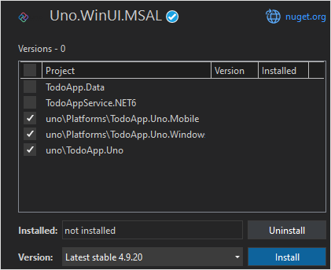
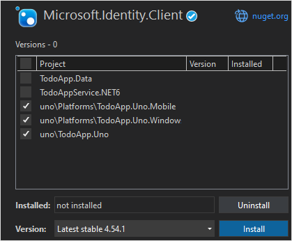

# Add authentication to your Uno Platform app

In this tutorial, you add Microsoft authentication to the TodoApp project using Azure Active Directory. Before completing this tutorial, ensure you've [created the project and deployed the backend](./index.md).

> [!TIP]
> Although we use Azure Active Directory for authentication, you can use any authentication library you wish with Azure Mobile Apps.  

[!INCLUDE [Register with AAD for the backend](~/mobile-apps/azure-mobile-apps/includes/quickstart/common/register-aad-backend.md)]

[!INCLUDE [Configure the service for authentication](~/mobile-apps/azure-mobile-apps/includes/quickstart/windows/configure-auth-backend.md)]

## Add authentication to the app

The Microsoft Datasync Framework has built-in support for any authentication provider that uses a Json Web Token (JWT) within a header of the HTTP transaction.  This application uses the [Microsoft Authentication Library (MSAL)](/azure/active-directory/develop/msal-overview) to request such a token and authorize the signed in user to the backend service.  For more information on integrating MSAL into an Uno Platform project, review [their documentation](https://platform.uno/docs/articles/interop/MSAL.html);

[!INCLUDE [Configure a native app for authentication](~/mobile-apps/azure-mobile-apps/includes/quickstart/common/register-aad-client.md)]

Open the `TodoApp.sln` solution in Visual Studio. Add the [Uno.WinUI.MSAL](https://platform.uno/docs/articles/interop/MSAL.html) to each of the `TodoApp.Uno` projects:

1. Right-click on the solution, then select **Manage NuGet Packages...**.
2. Select the **Browse** tab.
3. Enter `Uno.WinUI.MSAL` in the search box, then press Enter.
4. Select the `Uno.WinUI.MSAL` result.
5. In the right hand panel, select each of the `TodoApp.Uno` projects.
6. Select **Install**.

   

7. Accept the license agreement to continue the installation.

Use the same technique to add the [Microsoft.Identity.Client](/azure/active-directory/develop/msal-overview) library to each of the `TodoApp.Uno` projects:

1. Enter `Microsoft.Identity.Client` in the search box, then press Enter.
2. Select the `Microsoft.Identity.Client` result.
3. In the right hand panel, select each of the `TodoApp.Uno` projects.
4. Select **Install**.

   

5. Accept the license agreement to continue the installation.

> [!NOTE]
> Ensure you install the latest versions of these two libraries.

Add the native client ID and backend scope to the configuration.

Open the `TodoApp.Data` project and edit the `Constants.cs` file. Add constants for `ApplicationId` and `Scopes`:

``` csharp
  public static class Constants
  {
      /// <summary>
      /// The base URI for the Datasync service.
      /// </summary>
      public static string ServiceUri = "https://demo-datasync-quickstart.azurewebsites.net";

      /// <summary>
      /// The application (client) ID for the native app within Azure Active Directory
      /// </summary>
      public static string ApplicationId = "<client-id>";

      /// <summary>
      /// The list of scopes to request
      /// </summary>
      public static string[] Scopes = new[]
      {
          "<scope>"
      };
  }
```

Replace the `<client-id>` with the _Native Client Application ID_ you received when registering the client application in Azure Active Directory, and the `<scope>` with the _Web API Scope_ you copied when you used **Expose an API** while registering the service application.

Open the `MainPage.xaml.cs` file in the top folder of the `TodoApp.Uno` project.  

Add the following `using` statements to the top of the file:

``` csharp
using Microsoft.Datasync.Client;
using Microsoft.Identity.Client;
using System.Diagnostics;
using System.Linq;
using Uno.UI.MSAL;
```

Remove the `TodoService` property and replace it with the following code:

``` csharp
    private readonly IPublicClientApplication _identityClient;
    private readonly TodoListViewModel _viewModel;
    private readonly ITodoService _service;

    public MainPage() {
        this.InitializeComponent();

#if __ANDROID__
        _identityClient = PublicClientApplicationBuilder
            .Create(Constants.ApplicationId)
            .WithAuthority(AzureCloudInstance.AzurePublic, "common")
            .WithRedirectUri($"msal{Constants.ApplicationId}://auth")
            .WithUnoHelpers()
            .Build();
#elif __IOS__
        _identityClient = PublicClientApplicationBuilder
            .Create(Constants.ApplicationId)
            .WithAuthority(AzureCloudInstance.AzurePublic, "common")
            .WithIosKeychainSecurityGroup("com.microsoft.adalcache")
            .WithRedirectUri($"msal{Constants.ApplicationId}://auth")
            .WithUnoHelpers()
            .Build();
#else
        _identityClient = PublicClientApplicationBuilder
            .Create(Constants.ApplicationId)
            .WithAuthority(AzureCloudInstance.AzurePublic, "common")
            .WithRedirectUri("https://login.microsoftonline.com/common/oauth2/nativeclient")
            .WithUnoHelpers()
            .Build();
#endif
        _service = new RemoteTodoService();
        _viewModel = new TodoListViewModel(this, _service);
        mainContainer.DataContext = _viewModel;
    }
```

Add the following method into the `MainPage` class:

``` csharp
    public async Task<AuthenticationToken> GetAuthenticationToken()
    {
        var accounts = await _identityClient.GetAccountsAsync();
        AuthenticationResult result = null;
        bool tryInteractiveLogin = false;

        try
        {
            result = await _identityClient
                .AcquireTokenSilent(Constants.Scopes, accounts.FirstOrDefault())
                .ExecuteAsync();
        }
        catch (MsalUiRequiredException)
        {
            tryInteractiveLogin = true;
        }
        catch (Exception ex)
        {
            System.Diagnostics.Debug.WriteLine($"MSAL Silent Error: {ex.Message}");
        }

        if (tryInteractiveLogin)
        {
            try
            {
                result = await _identityClient
                    .AcquireTokenInteractive(Constants.Scopes)
                    .WithUnoHelpers()
                    .ExecuteAsync();
            }
            catch (Exception ex)
            {
                System.Diagnostics.Debug.WriteLine($"MSAL Interactive Error: {ex.Message}");
            }
        }

        return new AuthenticationToken
        {
            DisplayName = result?.Account?.Username ?? string.Empty,
            ExpiresOn = result?.ExpiresOn ?? DateTimeOffset.MinValue,
            Token = result?.AccessToken ?? string.Empty,
            UserId = result?.Account?.Username ?? string.Empty
        };
    }
```

The `GetAuthenticationToken()` method works with the Microsoft Identity Library (MSAL) to get an access token suitable for authorizing the signed-in user to the backend service.  This function is then passed to the `RemoteTodoService` for creating the client.  If the authentication is successful, the `AuthenticationToken` is produced with data necessary to authorize each request.  If not, then an expired bad token is produced instead.

## Configure the Android app for authentication

Open the `TodoApp.Uno.Mobile` project and expand the `Android` folder.  Create a new class `TodoApp.Uno\TodoApp.Uno.Mobile\Android\MsalActivity.Android.cs` with the following code:

``` csharp
using Android.Content;
using Microsoft.Identity.Client;

namespace TodoApp.Uno.Droid
{
    [Activity(Exported = true)]
    [IntentFilter(new[] { Intent.ActionView },
       Categories = new[] { Intent.CategoryBrowsable, Intent.CategoryDefault },
       DataHost = "auth",
       DataScheme = "msal{client-id}")]
    public class MsalActivity : BrowserTabActivity
    {
    }
}
```

Replace `{client-id}` with the application ID of the native client (which is the same as `Constants.ApplicationId`).

Edit the `TodoApp.Uno\TodoApp.Uno.Mobile\Android\MainActivity.Android.cs` class; add the `OnActivityResult` method:

``` csharp
    [Activity(
        MainLauncher = true,
        ConfigurationChanges = global::Uno.UI.ActivityHelper.AllConfigChanges,
        WindowSoftInputMode = SoftInput.AdjustNothing | SoftInput.StateHidden
    )]
    public class MainActivity : Microsoft.UI.Xaml.ApplicationActivity
    {
        protected override void OnActivityResult(int requestCode, Result resultCode, Android.Content.Intent data)
        {
            base.OnActivityResult(requestCode, resultCode, data);
            AuthenticationContinuationHelper.SetAuthenticationContinuationEventArgs(requestCode, resultCode, data);
        }
    }
```

When the Android requires authentication, it obtains an identity client, then switch to an internal activity that opens the system browser. Once authentication is complete, the system browser redirects to the defined redirect URL (`msal{client-id}://auth`). The `MasalActvity` traps the redirect URL, which then switches back to the main activity by calling `OnActivityResult()`. The `OnActivityResult()` method calls the MSAL authentication helper to complete the transaction.

## Configure the iOS app for authentication

Open the `TodoApp.Uno.Mobile` project and expand the `iOS` folder. Update the `Entitlements.plist` file to include the `keychain-access-groups`:

``` xml
<?xml version="1.0" encoding="UTF-8"?>
<!DOCTYPE plist PUBLIC "-//Apple//DTD PLIST 1.0//EN" "http://www.apple.com/DTDs/PropertyList-1.0.dtd">
<plist version="1.0">
	<dict>
		<key>keychain-access-groups</key>
		<array>
			<string>$(AppIdentifierPrefix)com.microsoft.adalcache</string>
		</array>
	</dict>
</plist>
```

## Test the Android app  

Set `TodoApp.Uno.Mobile` as the startup project, select an android emulator as the target, then press **F5** to build and run the app. When the app starts, you are prompted to sign in to the app. On the first run, you are also asked to consent to the app. Once authentication is complete, the app runs as normal.

## Test the iOS app  

Set `TodoApp.Uno.Mobile` as the startup project, select an iOS simulator as the target, then press **F5** to build and run the app. When the app starts, you are prompted to sign in to the app. On the first run, you are also asked to consent to the app. Once authentication is complete, the app runs as normal.


##  Test the Windows app

Set `TodoApp.Uno.Windows` as the startup project, then press **F5** to build and run the app. When the app starts, you are prompted to sign in to the app. On the first run, you are also asked to consent to the app. Once authentication is complete, the app runs as normal.

## Next steps

Next, configure your application to operate offline by [implementing an offline store](./offline.md).

## Further reading

* [Quickstart: Protect a web API with the Microsoft identity platform](/azure/active-directory/develop/web-api-quickstart?pivots=devlang-aspnet-core)
  